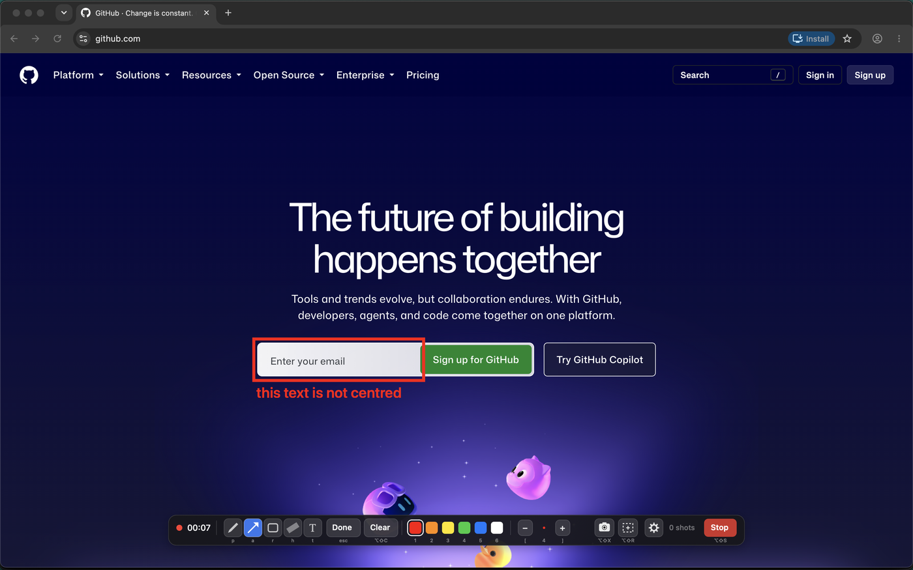
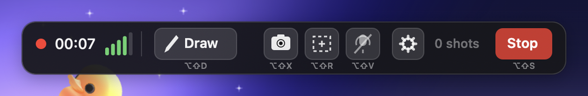
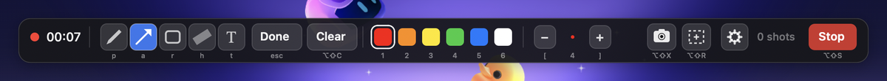

# recordfeedback

Talk to Claude Code instead of typing at it, and point at the screen
while you talk.

You type `/recordfeedback` in any Claude Code session. Recording starts.
You keep using your computer and you say what you want. You draw arrows,
boxes and highlights straight on the screen, and you press a key to
capture. When you press stop, Claude Code wakes up holding one document:
the transcript, the screenshots in the order you took them, and the
sentence you were saying when each one was taken. Then it starts working.

The value is the join. Typing feedback is slower than saying it, and a
screenshot without the sentence that goes with it is a puzzle.

Everything runs on your machine. Audio is transcribed locally with
whisper.cpp and nothing is uploaded.



Above: a real session over a real browser. The box and the note are drawn
on the screen itself, over whatever application happens to be in front,
so they are inside the screenshot rather than notes attached to it. The
palette along the bottom is the whole interface.

## What comes out

```markdown
# Feedback session 2026-08-24 15:20

Duration 41s. 1 screenshot. Language en. Started in `~/Projects/app` on branch `main`.

## Transcript

[00:00] the spacing under the header is wrong, it should match the card below it


[00:31] and this button needs to be secondary, not primary
```

A plain markdown file with absolute paths. No MCP server, no proprietary
format, no account. It outlives the tool that wrote it.

## Requirements

macOS on Apple silicon. Built and used on macOS 14.4.1 and Swift 5.10.

```bash
brew install ffmpeg fswatch whisper-cpp jq
xcode-select --install     # for swiftc, if you do not have it
```

A whisper model, about 550 MB:

```bash
mkdir -p ~/.recordfeedback/models
curl -L -o ~/.recordfeedback/models/ggml-large-v3-turbo-q5_0.bin \
  https://huggingface.co/ggerganov/whisper.cpp/resolve/main/ggml-large-v3-turbo-q5_0.bin
```

Any ggml model works. Point `RF_MODEL` at a smaller one if you would
rather trade accuracy for speed.

## Install

```bash
git clone https://github.com/typestatecom/recordfeedback.git
cd recordfeedback
./install.sh
recordfeedback doctor
```

`install.sh` symlinks the CLI into `~/.local/bin` as `recordfeedback` and
`rfb`, puts the slash command in `~/.claude/commands/`, and builds the
overlay. `doctor` checks every dependency, the model, the microphone and
the screen recording permission, and tells you what to click if something
is missing.

Two things macOS will ask for the first time, both for your terminal
application and not for this tool:

- **Microphone.** The prompt appears when `doctor` or `start` records.
- **Screen Recording**, in System Settings, Privacy and Security. Without
  it your screenshots contain the wallpaper and none of your windows.

One thing macOS will not ask for. If your screenshots land in `~/Desktop`
or `~/Documents`, macOS blocks the terminal from reading them and no
screenshot is ever collected. Move them somewhere unprotected:

```bash
mkdir -p ~/Screenshots
defaults write com.apple.screencapture location ~/Screenshots
killall SystemUIServer
```

`doctor` fails loudly if this is wrong, because the failure is otherwise
silent.

## Daily use

Type `/recordfeedback` in Claude Code and talk. The keys it prints are
the ones actually bound, since you can rebind all of them:

| Key | |
| --- | --- |
| `opt-shift-D` | draw |
| `opt-shift-X` | screenshot |
| `opt-shift-R` | region |
| `opt-shift-S` | stop |
| `opt-shift-Z` | undo |
| `opt-shift-C` | clear |
| `opt-shift-H` | hide the marks |

In draw mode: `p` pen, `a` arrow, `r` rectangle, `h` highlighter, `t`
text. `1` to `6` pick a colour, `[` and `]` change the width, `esc` or
`Done` or the same tool again stops drawing. Change any of it with the
gear in the palette or its menu bar item.

The palette has two rows. While you are only talking it stays out of the
way:



and it opens into the full row when you start drawing:



Every key is written under the control it belongs to, so the palette is
also the reminder. Left to right: how long the session has run, the five
tools, the two ways back out of a mistake, the six colours, the width,
the two capture keys, the settings gear, how many screenshots you have
taken, and stop.

The marks are on the screen, so they are inside the image. A region
capture crops the same marks.

## The CLI

The slash command drives this, and you can too.

```
recordfeedback start [--note TEXT] [--device N] [--no-overlay]
                begin a session: record audio and arm the overlay
recordfeedback wait [--timeout SECONDS]
                block until the stop hotkey, the recorder dying, or a timeout
recordfeedback stop
                end the session, collect screenshots, transcribe, write feedback.md
recordfeedback status    the live session, how long it has run, what it captured
recordfeedback abort     stop everything and throw the session away
recordfeedback last      path of the newest session that has a feedback.md
recordfeedback devices   the avfoundation audio inputs and their indexes
recordfeedback doctor    check every dependency, the model, the mic and the overlay
```

Sessions live outside the repository, in
`~/.recordfeedback/sessions/<timestamp>/`, holding the audio, the
transcript, the screenshots and `feedback.md`.

## What accumulates on disk

Worth knowing before you use it on anything sensitive. Every session
keeps, forever and in the clear:

- the recorded audio, and a verbatim transcript of everything said while
  the microphone was live, including whatever else was in the room,
- full screen screenshots, which capture every window that was open and
  not only the one you were pointing at.

There is no retention policy, no pruning and no automatic cleanup
anywhere in this tool. That is deliberate, since a session you cannot go
back to is worth little, but it means the folder only grows. Delete what
you no longer want:

```bash
rm -rf ~/.recordfeedback/sessions/<timestamp>
```

Nothing leaves your machine. Transcription is local whisper.cpp, and the
tool makes no network calls at all.

Environment: `RF_HOME`, `RF_MODEL`, `RF_LANG`, `RF_SHOT_DIR`,
`RF_KEEP_SHOTS`, `RF_BIN_DIR`, `RF_COMMANDS_DIR`.

## Development

```bash
test/run.sh              the whole suite, one line per case
overlay/build.sh         rebuild the Swift overlay
overlay/build.sh --probes  the variant the test suite drives
```

The overlay is one Swift file per type, compiled by a single `swiftc`
call over `overlay/`. The selftest probes the suite drives are compiled
out of the binary you install, so `RF_OVERLAY_SELFTEST` reaches nothing
in a shipped build.

The tests drive the real ffmpeg, whisper-cli, screencapture and AppKit
rather than mocking them, using `RF_FFMPEG_INPUT` and a `say` fixture so
no microphone and no person is needed. A test that mocks those tests
nothing.

`docs/screenshots/make.sh` rebuilds the images in this file. It opens the
page in a Chrome started on a throwaway profile, so the shots are signed
out and carry no bookmarks, no extensions and nobody's account, and it
crops the palette from the frame the overlay reports rather than by eye.
`RF_SHOT_SITE` picks the page.

- `SPEC.md` is the contract and holds the facts already checked.
- `CLAUDE.md` is how to work in this repository.
- `docs/decisions.md` is the engineering calls worth keeping.

## Licence

MIT. See `LICENSE`.
